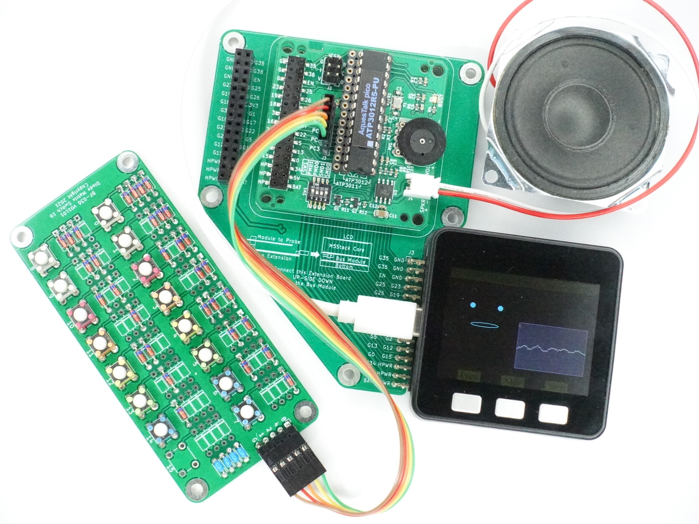
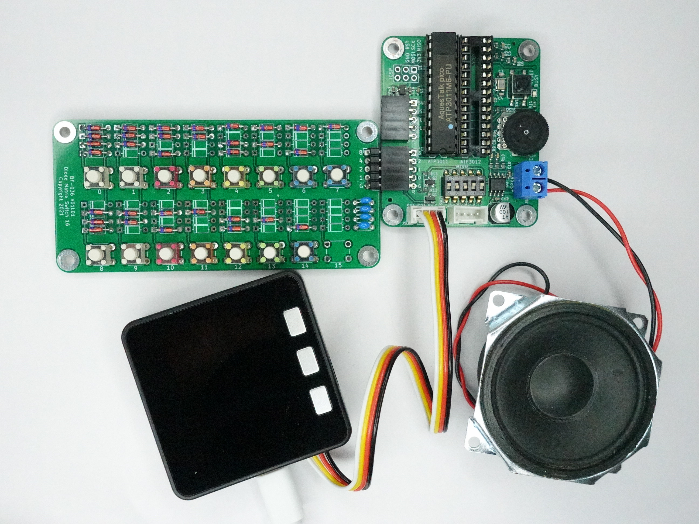
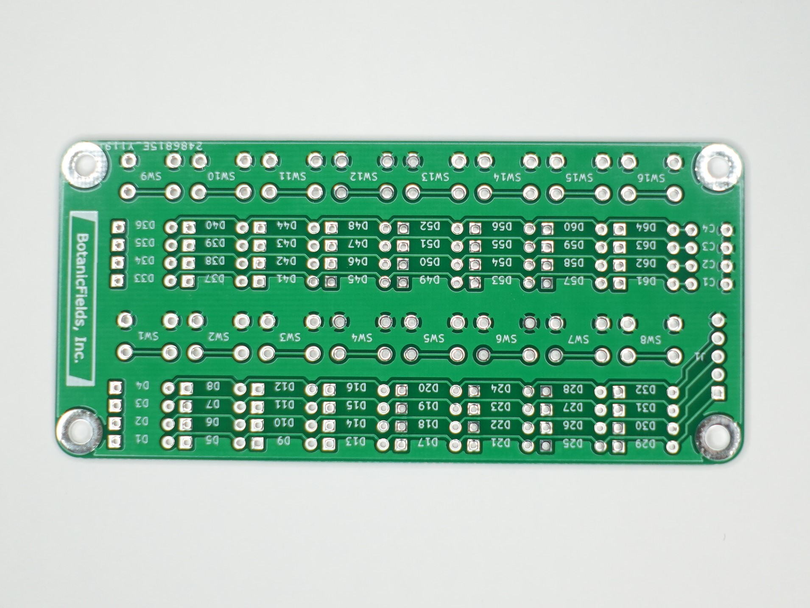
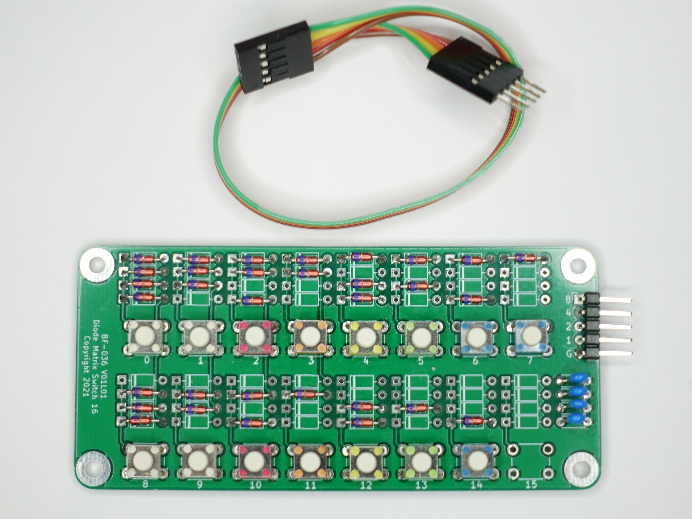

# PCB-Diode-Matrix-Switch-16

# ダイオードマトリクススイッチ16基板
タクトスイッチで4ビットのデータパターンを生成するダイオードマトリクス基板（未実装）です。
AquesTalk pico LSI のスタンドアロンモードの制御に使用できます。

### 委託販売
（スイッチサイエンス扱い）[ダイオードマトリクススイッチ16基板](https://www.switch-science.com/catalog/7626/)

### 動作例
（YouTube）[Diode Matrix Switch 16 & AquesTalk pico LSI](https://youtu.be/Nlrulnu14eA)  

### 関連製品
（スイッチサイエンス扱い）[M5Stack用 AquesTalk pico LSIモジュール基板](https://www.switch-science.com/catalog/7624/)  
（GitHub）[botanicfields/PCB-MBUS-AquesTalk-pico-LSI](https://github.com/botanicfields/PCB-MBUS-AquesTalk-pico-LSI)  
（スイッチサイエンス扱い）[AquesTalk pico LSI用Grove(M5)接続基板](https://www.switch-science.com/catalog/7625/)  
（GitHub）[botanicfields/PCB-Grove-AquesTalk-pico-LSI](https://github.com/botanicfields/PCB-Grove-AquesTalk-pico-LSI)  

 

## 1. 特徴
- タクトスイッチを押すと、ダイオードを実装したデータラインがGNDレベル"0"になります。
- AquesTalk pico LSI のスタンドアロンモードで、15種類の音声をスイッチ操作で再生できます。
- 全てのタクトスイッチにダイオード4本分のランドがあり、データパターンをカスタマイズできます。
- リード線タイプの一般的なスイッチング用ダイオード（1N4148など）を使用できます。
- 6mmサイズの一般的なタクトスイッチを使用できます。

## 2. 内容物
- プリント基板（未実装） 1枚

※部品、ケーブル、説明書は添付していません。

表面、裏面  
 

## 3. 別途必要なもの
　部品表(BF-036_BOM.pdf)を参考にしてください。

## 4. 組み立て例
　別途、部品が必要です。組み立てにはハンダ付けが必要です。タクトスイッチの下のシルクの数値に合わせ、"0"にするデータラインにダイオードを実装します。  
※4ビット（16種）のデータパターンのうち、"1111" だけはダイオードもタクトスイッチも不要です。AquesTalk pico LSI のスタンドアロンモードにおいても、"1111" は音声再生を起動できません。

