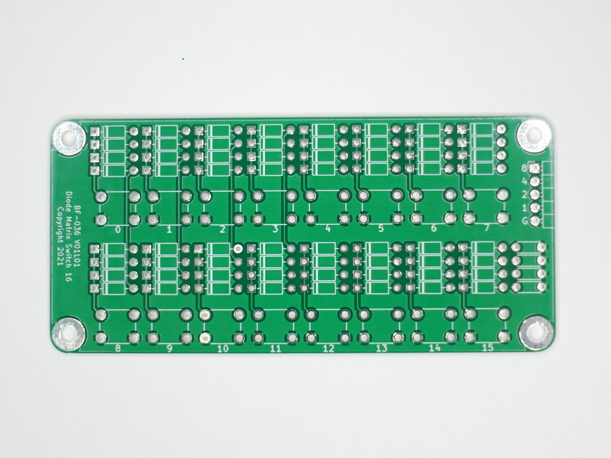

# PCB-Diode-Matrix-15

# ダイオードマトリクススイッチ15基板
タクトスイッチで、4ビットのデータパターンを生成するダイオードマトリクス基板（未実装）です。

## 1. 特徴
- タクトスイッチを押すと、ダイオードを実装したデータラインがGNDレベル"0"となります。
- AquesTalk pico LSI のスタンドアロンモードでのスイッチ操作に使用できます。
- 全てのタクトスイッチにダイオード4本分のランドがあり、データパターンをカスタマイズできます。
- リード線タイプの一般的なスイッチング用ダイオード（!N4148など）を使用できます。
- 6mmサイズの一般的なタクトスイッチを使用できます。

## 2. 組み立て例
別途、部品が必要です。組み立てにはハンダ付けが必要です。  
※4ビット（16種）のデータパターンのうち、"1111" だけはタクトスイッチが不要です。  

## 3. 内容物
- プリント基板（未実装） 1枚  

※部品、ケーブル、説明者は添付していません。  
表面、裏面  
 

## 4. 使用例
[GitHub: botanicfields/PCB-MBUS-AquesTalk-pico-LSI](https://github.com/botanicfields/PCB-MBUS-AquesTalk-pico-LSI)
